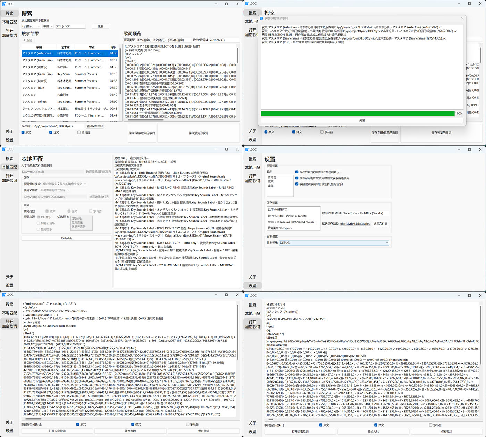
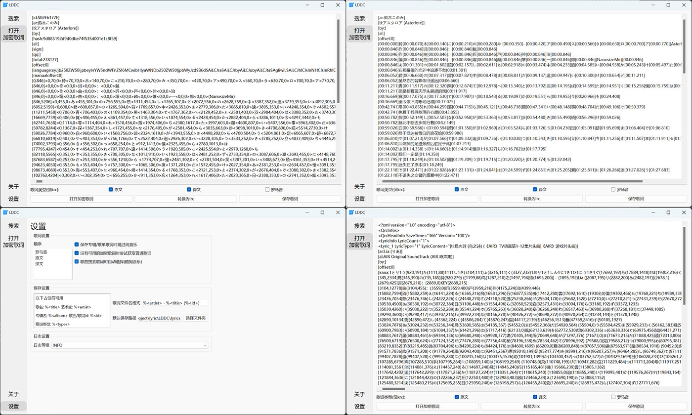

# LDDC

> 精准歌词(逐字歌词)下载解密转换

[](https://app.codacy.com/gh/chenmozhijin/LDDC/dashboard?utm_source=gh&utm_medium=referral&utm_content=&utm_campaign=Badge_grade)
[](https://github.com/chenmozhijin/LDDC/releases/latest)
[](https://www.python.org/downloads/)
[](https://github.com/chenmozhijin/LDDC/blob/main/LICENSE)
[](https://github.com/chenmozhijin/LDDC/releases/latest)

## 功能

- [x] 搜索QQ音乐、酷狗音乐的单曲、专辑、歌单
- [x] 下载整个 专辑、歌单 的歌词
- [x] 自动转换为精准lrc格式
- [x] 双击预览歌词,直接保存
- [x] 多种类型(原文、译文、罗马音)歌词随意合并
- [x] 保存路径多种占位符随意组合
- [x] 无可用加密歌词时尝试获取普通歌词
- [x] 支持打开本地的加密歌词

## 预览




## 使用方法

### 1.运行

#### 方式一:从[release](https://github.com/chenmozhijin/LDDC/releases)下载

1. 下载[release](https://github.com/chenmozhijin/LDDC/releases)中最新版本的zip压缩包
2. 解压zip包
3. 运行`LDDC.exe`

#### 方式二:直接运行LDDC.py

> 需要安装python3.10+环境

1. 下载源代码
2. 安装依赖库  
   进入源代码目录执行:

   ```bash
   pip install -r requirements.txt
   ```

3. 运行`LDDC.py`

### 2.使用

#### 1.搜索

1. 选择搜索类型，输入关键词
2. 双击选择对应结果,会 自动下载歌词或获取对应的专辑、歌单
3. 如果进入了专辑、歌单列表可点击"返回"返回搜索结果

#### 2.保存

1. "保存到"表示要保存歌词的文件夹,可以使用占位符,如:`D:\LDDC\lyrics\%<album>`
2. 如果预览了一个歌词可点击"保存预览的歌词"保存歌词
3. 如果进入了专辑、歌单列表可点击"保存专辑/歌单的歌词"下载列表中的歌词
4. 如果保存专辑/歌单的歌词时出现了错误,重试的速度会很快(因为有缓存)

#### 3.设置

1. 歌词设置中的顺序可以随意拖动(立即生效)

## 感谢

部分功能实现参考了以下项目:  

### 歌词解密

[](https://github.com/WXRIW/Lyricify-Lyrics-Helper)
[](https://github.com/jixunmoe/qmc-decode)
[](https://github.com/parakeet-rs/libparakeet)

### QQ音乐api

[](https://github.com/MCQTSS/MCQTSS_QQMusic)
