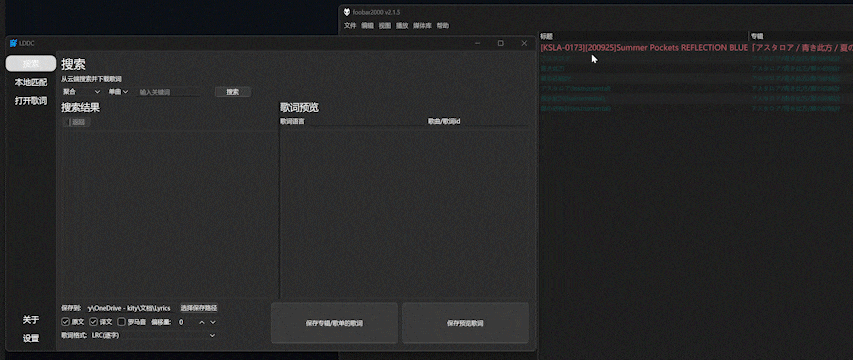
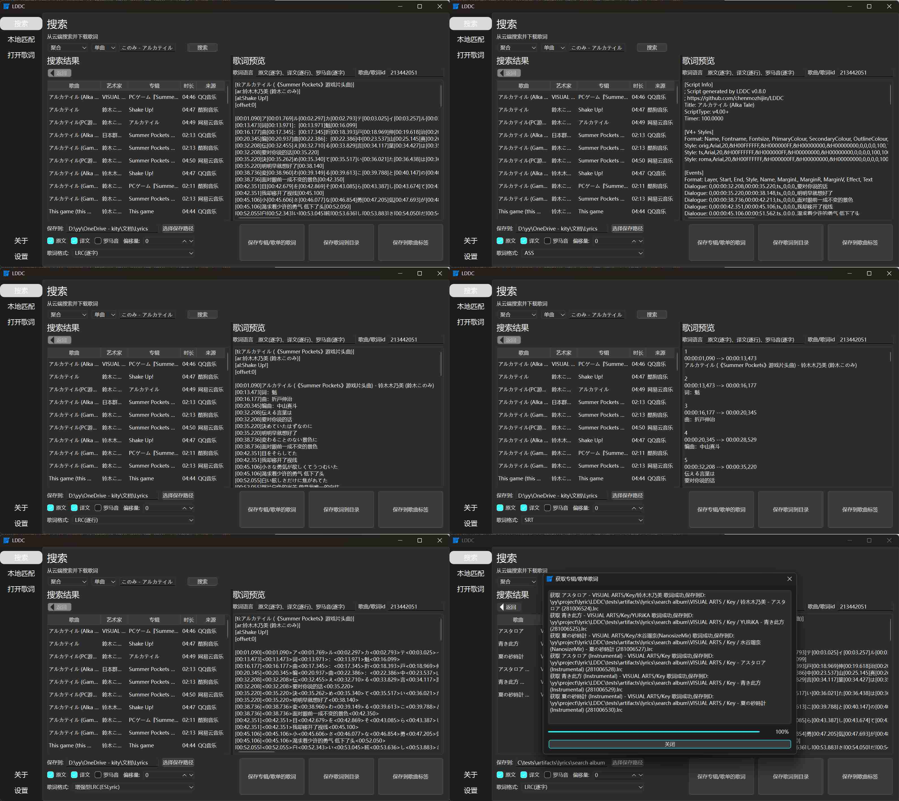
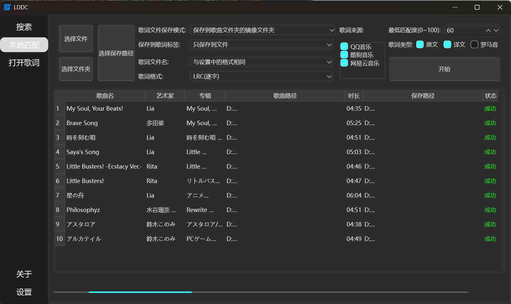
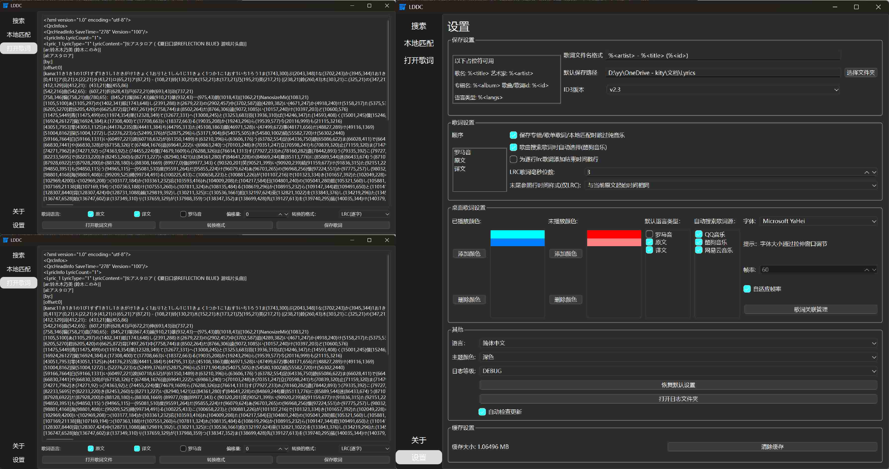
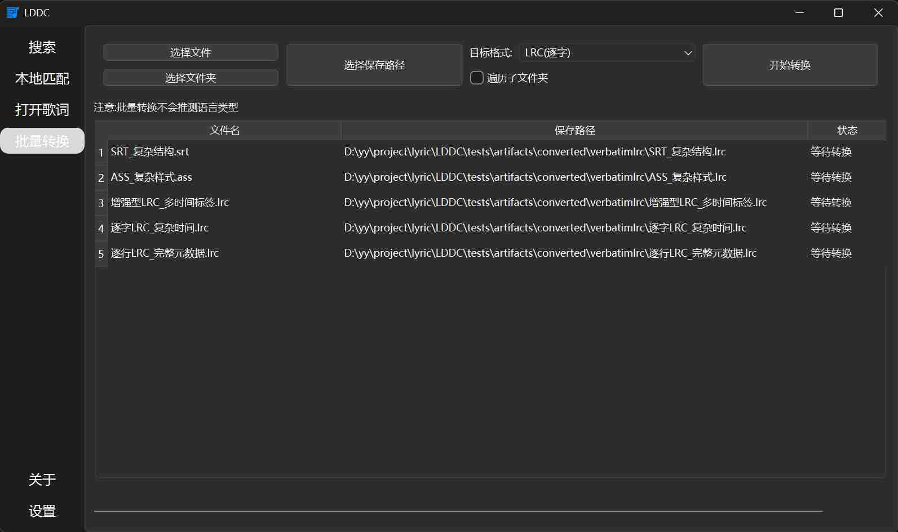

# LDDC

中文 | [English](./README_en.md) | [日本語](./README_ja.md)

LDDC是一个简单易用的精准歌词(逐字歌词)下载匹配工具。

## 主要特性

1. ⚡ **多线程快速匹配**：所有歌词匹配功能均采用多线程技术，实现**自动搜索**与**极速精准匹配**每一个歌词。
2. 📝 **逐字歌词样式**：绝大多数歌曲都能获取到**逐字样式**的歌词，精准同步到每个字。
3. 💾 **多种格式支持**：支持保存歌词为**逐字LRC**、**逐行LRC**、**增强型LRC**、**SRT**和**ASS**等格式，满足不同需求。
4. 🎵 **多音乐平台歌词搜索**：支持搜索**QQ音乐**、**酷狗音乐**、**网易云音乐**中的单曲、专辑和歌单，支持从 **[Lrclib](https://lrclib.net/)** 获取歌词。
5. 🖱️ **拖拽搜索**：将歌曲文件拖入界面，使用**多线程匹配**快速搜索匹配。
6. 🎯 **本地歌词匹配**：一键为本地歌曲文件精准匹配歌词，采用**多线程匹配**提高匹配速度。
7. 📥 **专辑/歌单歌词下载**：一键为整个**专辑**或**歌单**下载歌词。
8. 👀 **歌词预览与保存**：双击预览歌词，支持保存为**歌词文件**或直接写入**歌曲标签**。
9. 🛠️ **多样歌词组合**：灵活组合**原文**、**译文**、**罗马音**的歌词内容，满足个性化歌词需求。
10. 💻 **多系统支持**：支持 **Windows**、**macOS** 和 **Linux** 操作系统，满足不同用户的需求。
11. 🔧 **灵活保存路径**：支持使用多种路径占位符自定义保存路径。
12. 🔓 **加密歌词支持**：支持打开本地加密歌词文件。
13. 🎤 **桌面歌词（foobar2000插件：[foo_lddc](https://github.com/chenmozhijin/foo_lddc)）**：
    - 🚀 为播放的歌曲**多线程快速匹配**歌词。
    - 🎶 支持卡拉**OK样式**的歌词显示。
    - 🖊️ 支持**多行歌词显示**，可分别展示原文、翻译、罗马音的歌词内容
    - 🌈 支持歌词**淡入淡出**效果，并自动匹配屏幕刷新率，确保歌词显示流畅。
    - 🔍 提供类似搜索界面的窗口，方便手动选择歌词。
    - ✨ 实现字符缓存，降低系统资源占用。
    - 🌟 支持自定义**字符渐变色**效果。
14. 🔁 **歌词翻译功能**：支持使用**Bing/Google/OpenAI兼容API**进行歌词翻译
15. ♻️ **批量格式转换**：支持歌词格式批量转换功能

## 预览

### 拖拽搜索

### 搜索界面

### 本地匹配

### 打开歌词/设置界面

### 桌面歌词

### 批量转换

## 使用方法

见[LDDC使用指南](https://github.com/chenmozhijin/LDDC/wiki)

## 感谢

部分功能实现参考了以下项目:

### 歌词解密

