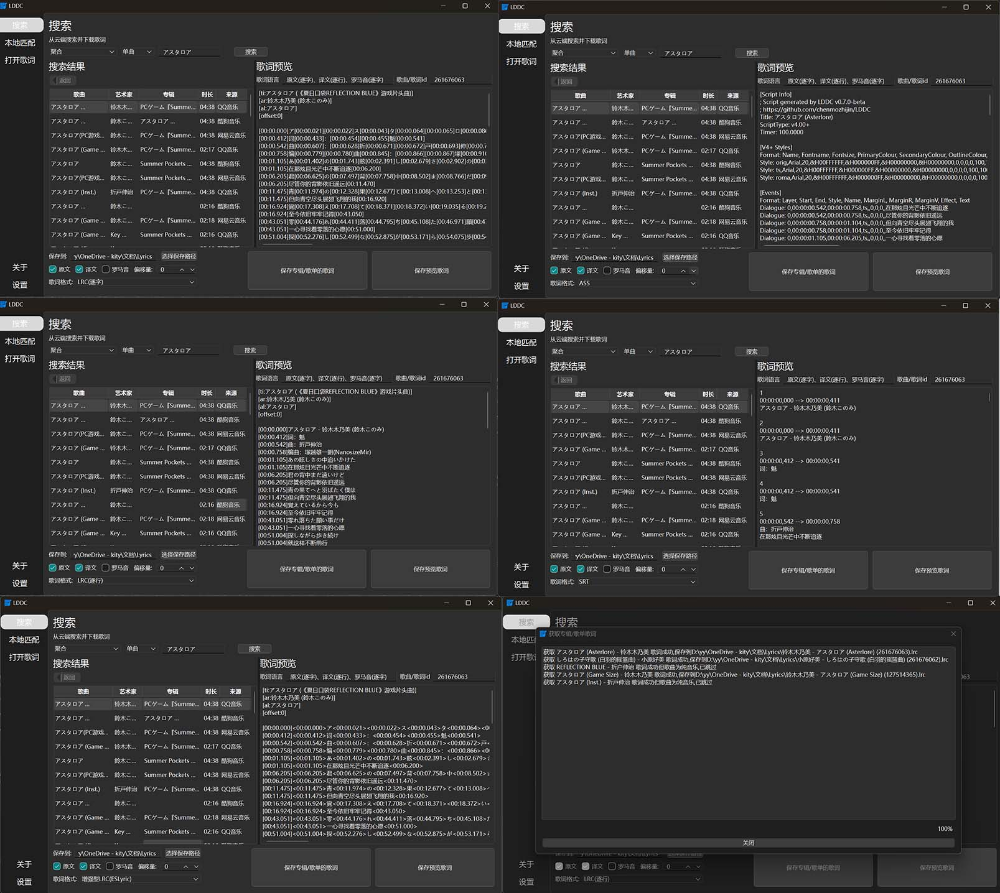
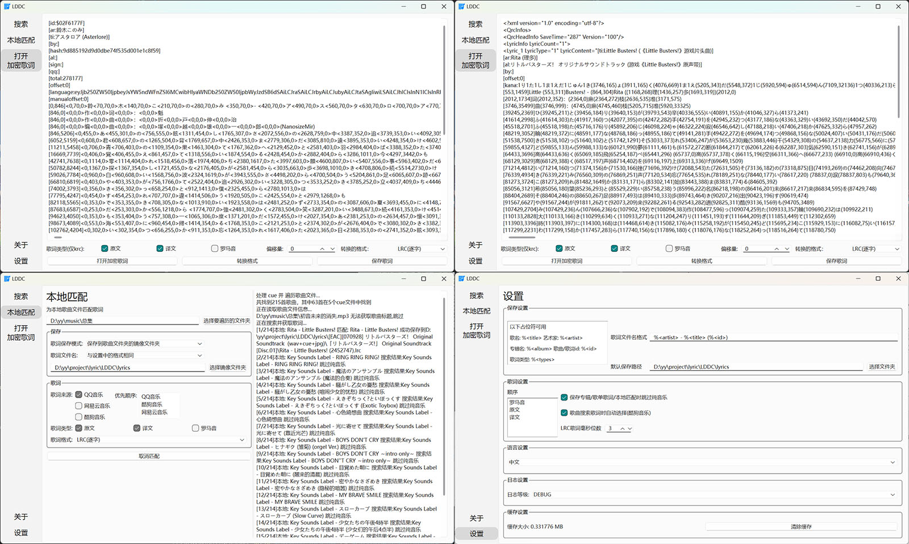

# LDDC

中文 | [English](./README_en.md)

> 精准歌词(逐字歌词)下载解密转换

## 功能

- [x] 搜索QQ音乐、酷狗音乐、网易云音乐的单曲、专辑、歌单
- [x] 一键下载整个 专辑、歌单 的歌词
- [x] 一键为本地歌曲文件匹配歌词
- [x] 支持保存为多种格式(逐字lrc、逐行lrc、增强型lrc、srt、ass)
- [x] 双击预览歌词,直接保存
- [x] 多种类型(原文、译文、罗马音)歌词随意合并
- [x] 保存路径多种占位符随意组合
- [x] 支持打开本地的加密歌词
- [x] 多平台支持
- [x] 桌面歌词(目前仅支持foobar2000: [foo_lddc](https://github.com/chenmozhijin/foo_lddc))
    1. 多线程自动搜索快速匹配歌词(绝大多数歌词为逐字样式)
    2. 支持显示卡拉OK样式的歌词
    3. 支持分行显示原文、翻译、罗马音
    4. 支持淡入淡出效果，并自动匹配屏幕刷新率以确保流畅性
    5. 支持通过类似搜索界面的窗口手动选择歌词
    6. 实现字符缓存，降低资源占用
    7. 支持自定义字符渐变色

## 预览

## 使用方法

见[LDDC使用指南](https://github.com/chenmozhijin/LDDC/wiki)

## 感谢

部分功能实现参考了以下项目:  

### 歌词解密

### 音乐平台api

