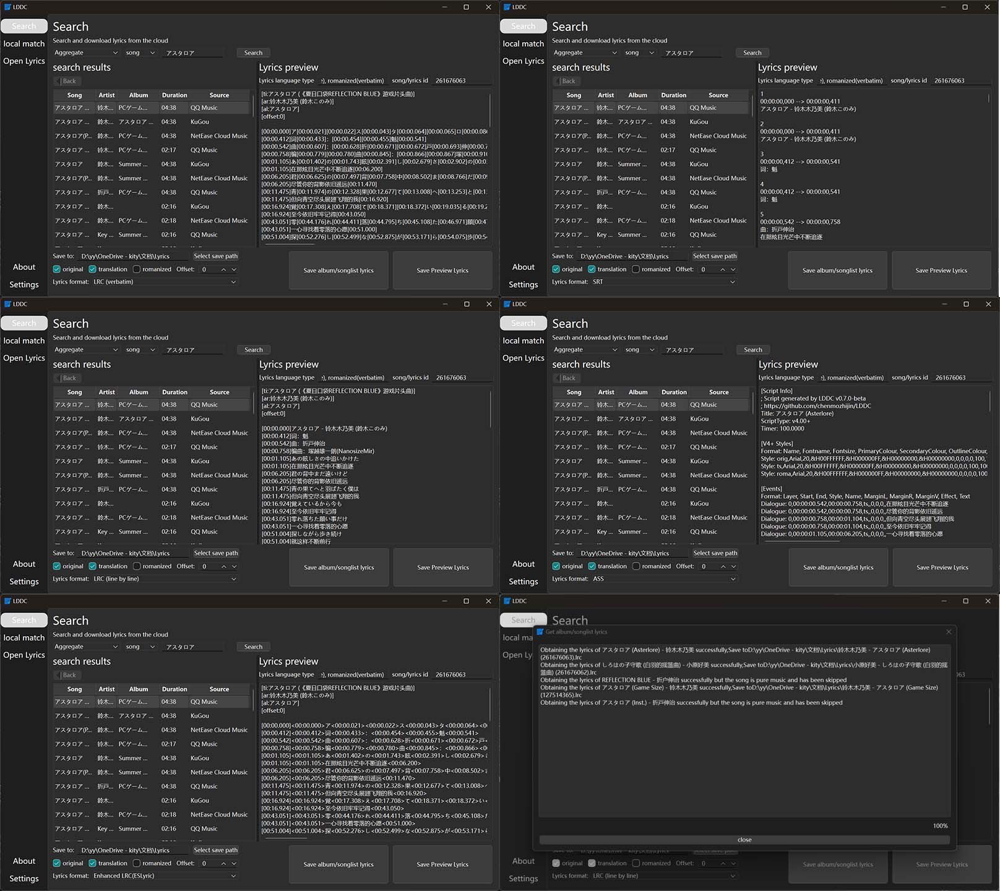
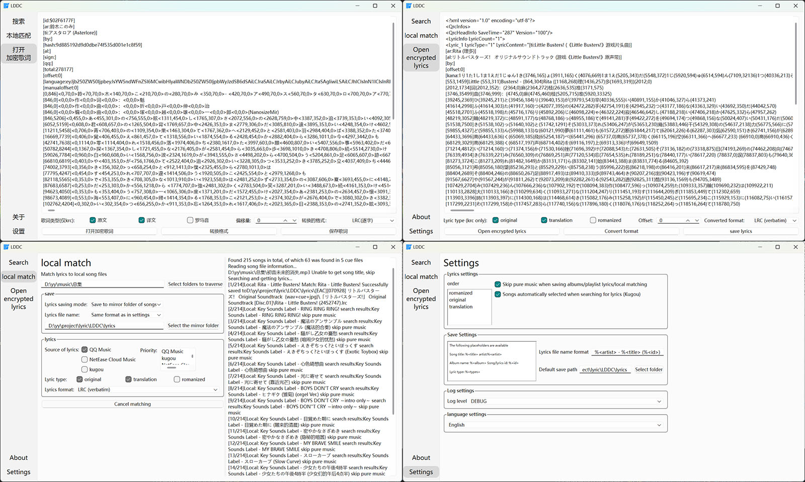
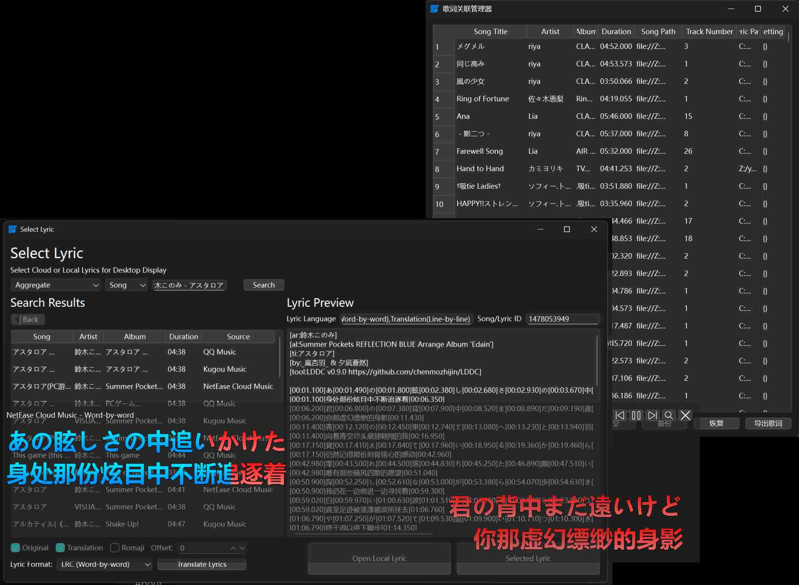
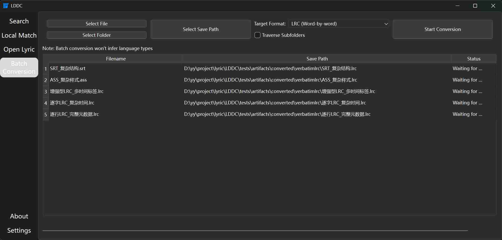

# LDDC

[中文](./README.md) | English | [日本語](./README_ja.md)

LDDC is a simple and precise lyric (character-level lyric) download and matching tool.

## Key Features

1. ⚡ **Multithreaded Fast Matching**: All lyric matching functions use multithreading technology for **automatic search** and **extremely fast and accurate matching** of each lyric.
2. 📝 **Character-Level Lyric Format**: Most songs can get **character-level lyrics** that are precisely synchronized with each character.
3. 💾 **Multiple Format Support**: Supports saving lyrics in **character-level LRC**, **line-level LRC**, **enhanced LRC**, **SRT**, and **ASS** formats to meet different needs.
4. 🎵 **Multi-Music Platform Lyric Search**: Supports searching for singles, albums, and playlists on **QQ Music**, **Kugou Music**, and **NetEase Cloud Music**, and supports fetching lyrics from **[Lrclib](https://lrclib.net/)**.
5. 🖱️ **Drag-and-Drop Search**: Drag and drop song files into the interface for **multithreaded matching** to quickly search for matching lyrics.
6. 🎯 **Local Lyric Matching**: One-click accurate matching of lyrics for local song files using **multithreading** to improve matching speed.
7. 📥 **Album/Playlist Lyric Download**: One-click download of lyrics for entire **albums** or **playlists**.
8. 👀 **Lyric Preview and Save**: Double-click to preview lyrics, support saving as **lyric files** or directly writing to **song tags**.
9. 🛠️ **Diverse Lyric Combinations**: Flexibly combine **original lyrics**, **translations**, and **romanization** to meet personalized lyric needs.
10. 💻 **Multi-System Support**: Supports **Windows**, **macOS**, and **Linux** operating systems to meet the needs of different users.
11. 🔧 **Flexible Save Paths**: Supports using various path placeholders to customize save paths.
12. 🔓 **Encrypted Lyric Support**: Supports opening local encrypted lyric files.
13. 🎤 **Desktop Lyrics (foobar2000 plugin: [foo_lddc](https://github.com/chenmozhijin/foo_lddc))**:
    - 🚀 **Multithreaded Fast Matching** for played songs.
    - 🎶 Supports **karaoke-style** lyric display.
    - 🖊️ Supports **multi-line lyric display**, showing original, translated, and romanized lyrics separately.
    - 🌈 Supports **fade-in/fade-out** effects for lyrics and automatically matches screen refresh rate for smooth lyric display.
    - 🔍 Provides a search-like window for manually selecting lyrics.
    - ✨ Implements **character caching** to reduce system resource usage.
    - 🌟 Supports **custom character gradient color** effects.
14. 🔁 **Lyric Translation Function**: Supports lyric translation using **Bing/Google/OpenAI compatible APIs**.
15. ♻️ **Batch Format Conversion**: Supports batch conversion of lyric formats.

## Preview

### Drag-and-Drop Search

### Search Interface

### Local Matching

### Open Lyrics/Settings Interface

### Desktop Lyrics

### Batch Conversion

## Usage

See [LDDC Usage Guide](https://github.com/chenmozhijin/LDDC/wiki)

## Thanks

Some features are implemented based on the following projects:

### Lyric Decryption

