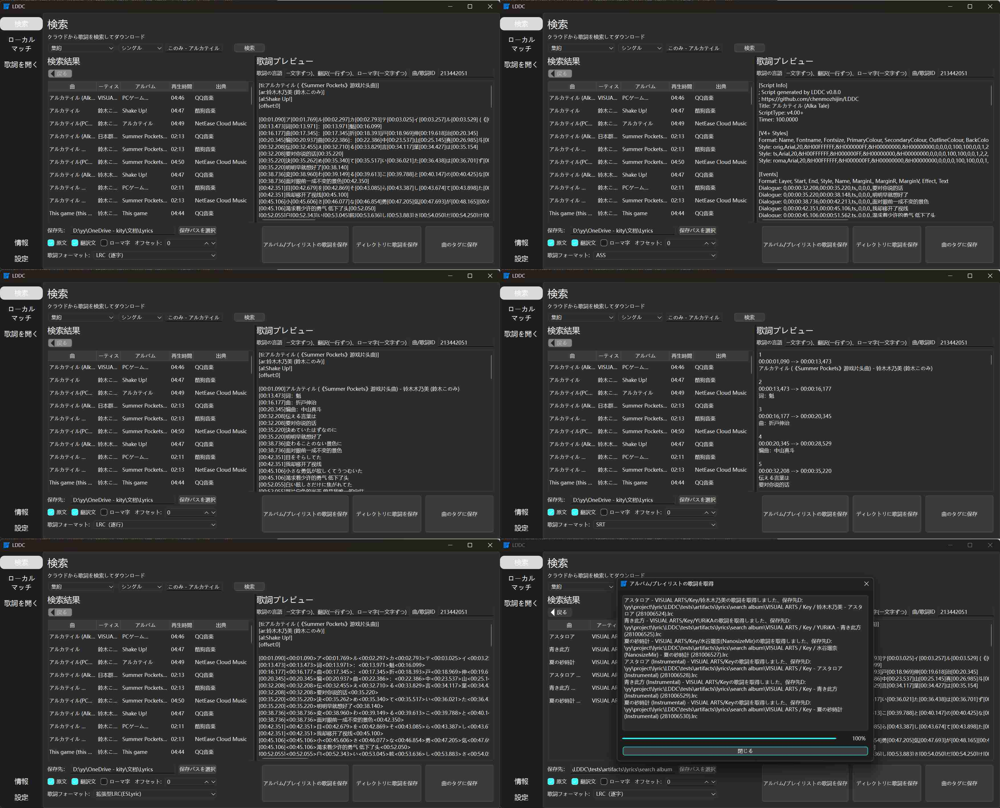
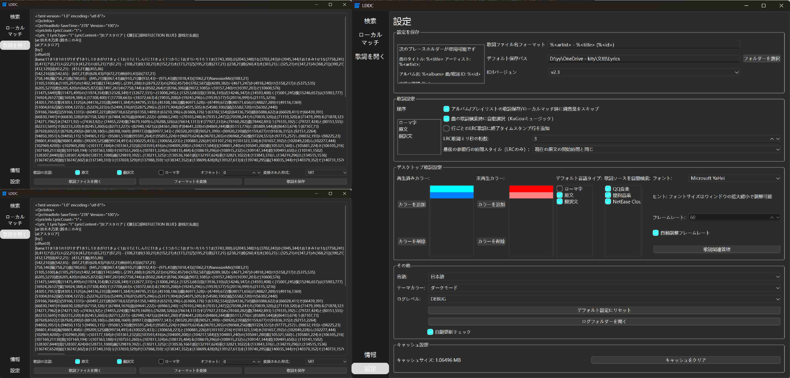
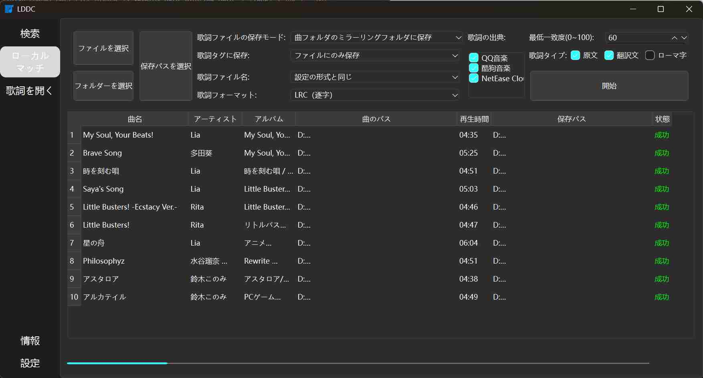
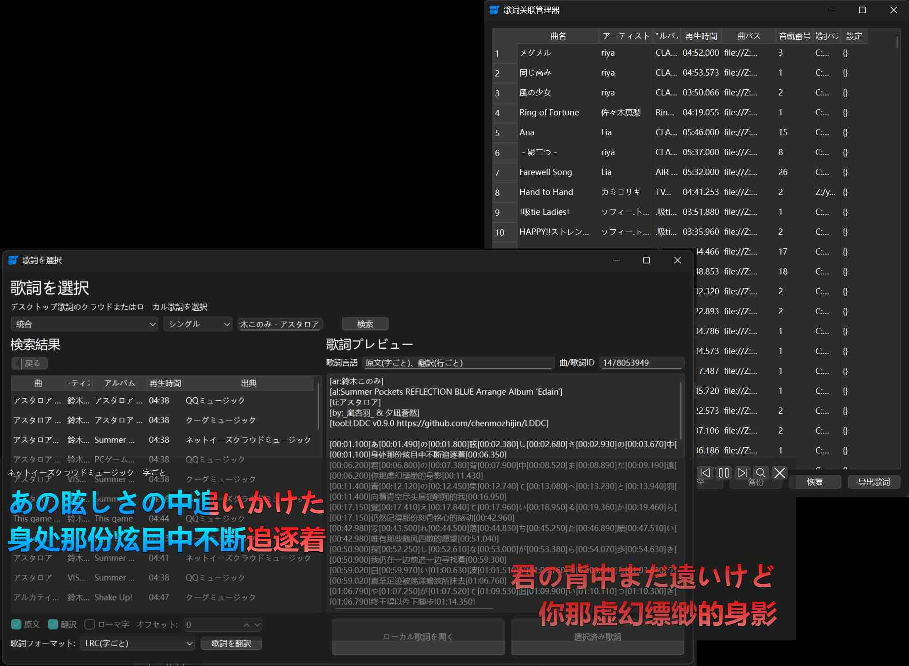
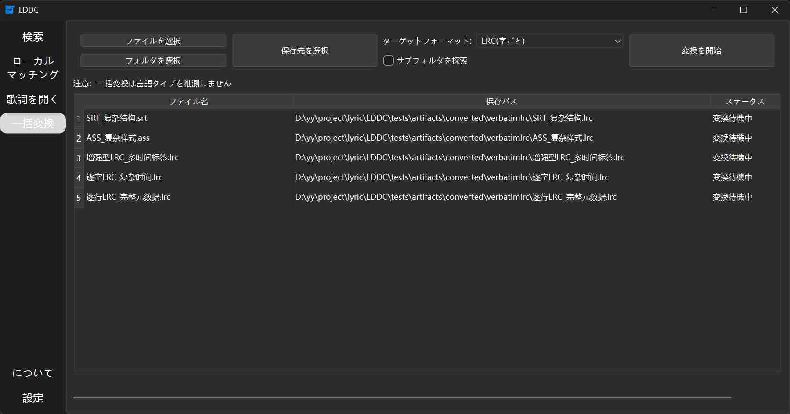

# LDDC

[中文](./README.md) | [English](./README_en.md) | 日本語

LDDCは、簡単で正確なリリック（文字単位のリリック）ダウンロードおよびマッチングツールです。

## 主な特徴

1. ⚡ **マルチスレッド高速マッチング**: すべてのリリックマッチング機能はマルチスレッド技術を使用し、**自動検索**と**非常に高速で正確なリリックのマッチング**を実現しています。
2. 📝 **文字単位のリリック形式**: 多くの楽曲で**文字単位のリリック**を取得でき、各文字と正確に同期します。
3. 💾 **複数フォーマット対応**: **文字単位LRC**、**行単位LRC**、**拡張LRC**、**SRT**、**ASS**などのフォーマットでリリックを保存でき、さまざまなニーズに対応します。
4. 🎵 **複数音楽プラットフォームのリリック検索**: **QQ Music**、**Kugou Music**、**NetEase Cloud Music**のシングル、アルバム、プレイリストの検索に対応し、**[Lrclib](https://lrclib.net/)**からリリックを取得できます。
5. 🖱️ **ドラッグアンドドロップ検索**: ソングファイルをインターフェースにドラッグアンドドロップして、**マルチスレッドマッチング**によりリリックを素早く検索できます。
6. 🎯 **ローカルリリックマッチング**: 1クリックでローカルの音楽ファイルに正確なリリックをマッチングし、**マルチスレッドマッチング**でマッチング速度を向上させます。
7. 📥 **アルバム/プレイリストリリックダウンロード**: **アルバム**または**プレイリスト**全体のリリックを1クリックでダウンロードできます。
8. 👀 **リリックプレビューと保存**: ダブルクリックでリリックをプレビューし、**リリックファイル**として保存するか、直接**音楽タグ**に書き込むことができます。
9. 🛠️ **多様なリリックの組み合わせ**: **オリジナルリリック**、**翻訳**、**ローマ字**を柔軟に組み合わせ、カスタマイズされたリリックのニーズに対応します。
10. 💻 **マルチシステムサポート**: **Windows**、**macOS**、**Linux**のオペレーティングシステムをサポートし、さまざまなユーザーのニーズに対応しています。
11. 🔧 **柔軟な保存パス**: 多様なパスプレースホルダーを使用してカスタマイズ可能な保存パスをサポートしています。
12. 🔓 **暗号化リリックサポート**: ローカルの暗号化リリックファイルを開くことができます。
13. 🎤 **デスクトップリリック(foobar2000プラグイン: [foo_lddc](https://github.com/chenmozhijin/foo_lddc))**:
    - 🚀 再生中の楽曲の**マルチスレッド高速マッチング**。
    - 🎶 **カラオケスタイル**のリリック表示をサポート。
    - 🖊️ **複数行リリック表示**をサポートし、オリジナル、翻訳、ローマ字のリリックを別々に表示できます。
    - 🌈 リリックの**フェードイン/ペードアウト**効果をサポートし、画面のリフレッシュレートに自動的にマッチしてリリック表示をスムーズにします。
    - 🔍 手動でリリックを選択するための検索風のウィンドウを提供します。
    - ✨ キャラクターキャッシュを実装し、システムリソースの使用を削減します。
    - 🌟 **カスタムキャラクターグラデーションカラー**効果をサポート。
14. 🔁 **リリック翻訳機能**: **Bing/Google/OpenAI互換API**を使用したリリック翻訳をサポート。
15. ♻️ **一括フォーマット変換**: リリックフォーマットの一括変換をサポート。

## プレビュー

### ドラッグアンドドロップ

### 検索インターフェース

### ローカルマッチング

### リリック/設定インターフェースを開く

### デスクトップリリック

### バッチ変換

## 使用方法

[LDDC使用ガイド](https://github.com/chenmozhijin/LDDC/wiki)を参照してください

## ありがとう

一部の機能は以下のプロジェクトに基づいて実装されています:

### リリックデコード

